# Auth-Server 가이드 문서

## 1. 개요

### 1.1 목적

Auth-Server는 플랫폼 내 사용자 인증(Authentication), 인가(Authorization), 회원 관리를 담당하는 마이크로서비스이다.

### 1.2 주요 기능

| 기능        | 설명                                |
|-----------|-----------------------------------|
| 이메일 회원가입  | 이메일/비밀번호 기반 회원 등록                 |
| 소셜 로그인    | Kakao, Apple, Google OAuth 2.0 연동 |
| JWT 토큰 관리 | Access/Refresh Token 발급 및 갱신      |
| 동의서 관리    | 필수/선택 약관 동의 추적                    |
| 사용자 정지    | 관리자 권한 계정 정지/해제                   |
| 회원 탈퇴     | Soft Delete 및 3년 보관 정책            |
| 이메일 인증    | 6자리 OTP 코드 검증                     |
| 비밀번호 관리   | 변경 및 재설정                          |

### 1.3 기술 스택

| 구분             | 기술                        |
|----------------|---------------------------|
| Framework      | Spring Boot 3.5.5         |
| Language       | Java 21 (Eclipse Temurin) |
| Database       | MariaDB 11.x              |
| Cache          | Redis 7.x                 |
| Message Broker | Apache Kafka              |
| Security       | JWT, PBKDF2, AES-256      |
| Documentation  | Swagger/OpenAPI 3.0       |

---

## 2. 시스템 아키텍처

### 2.1 전체 구조

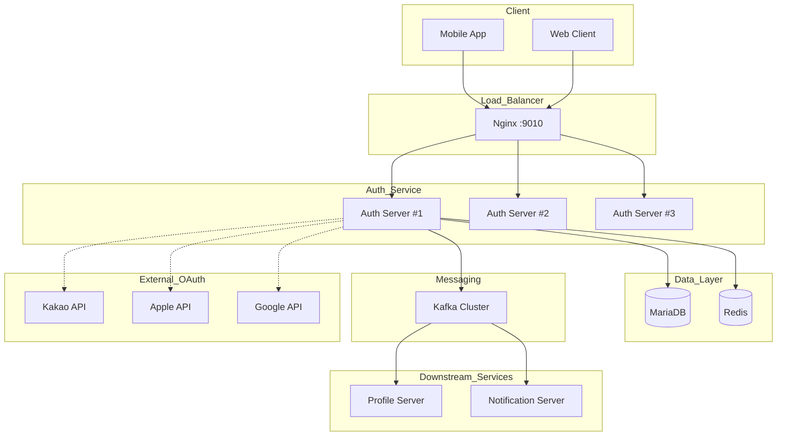

### 2.2 레이어 아키텍처

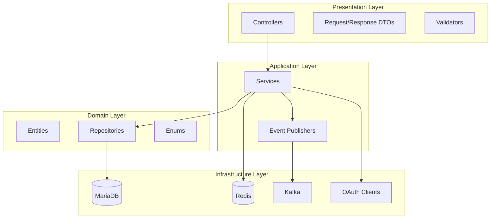

### 2.3 이메일 로그인 흐름

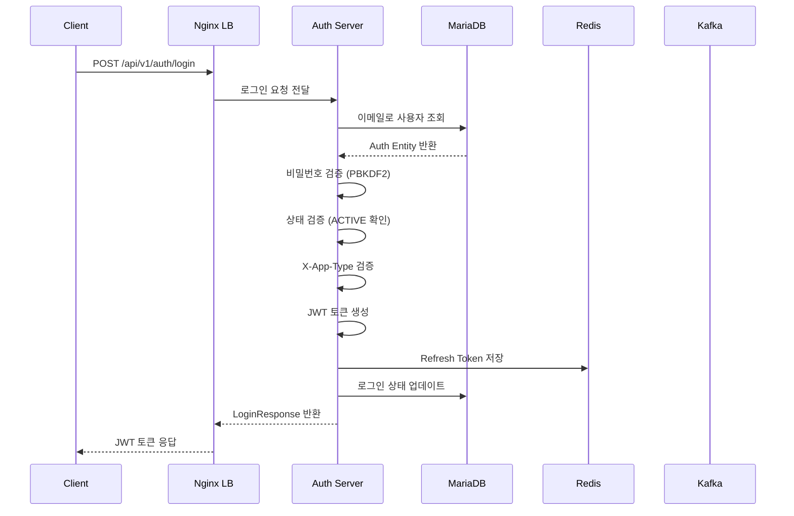

### 2.4 소셜 로그인 흐름

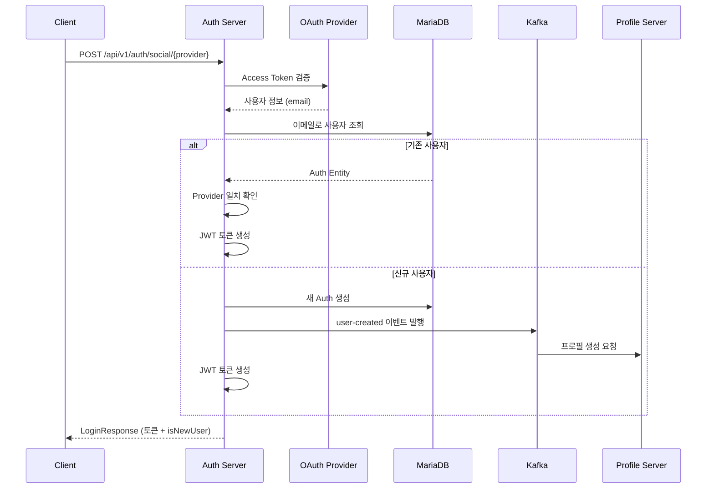

### 2.5 회원가입 흐름

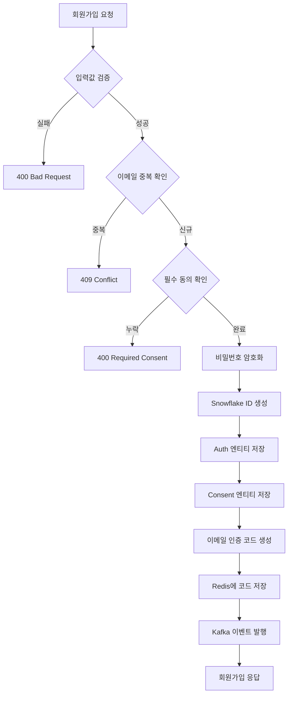

### 2.6 토큰 갱신 흐름

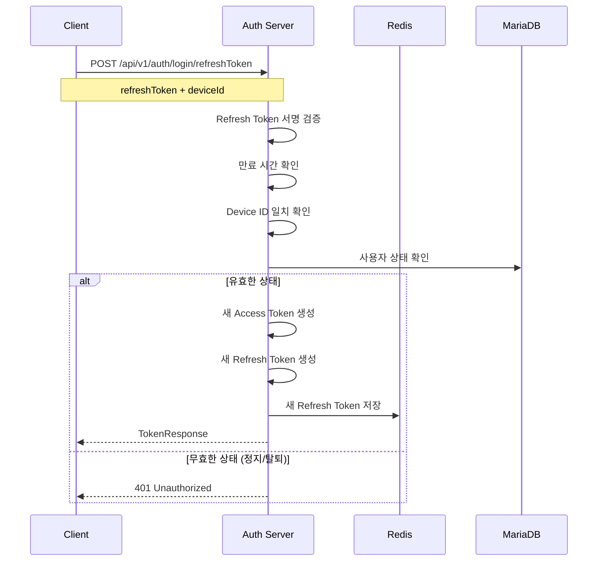

---

## 3. 데이터 모델

### 3.1 ERD

```mermaid
erDiagram
    Auth ||--o{ History: has
    Auth ||--o{ Consent: agrees
    Auth ||--o| Withdraw: withdraws
    Auth ||--o{ Suspend: suspended
    Auth ||--o| LoginStatus: tracks
    Consent }o--|| ConsentsTable: references

    Auth {
        string id PK "Snowflake ID"
        string email "AES-256 암호화"
        string password "PBKDF2 해시"
        string phoneNumber "AES-256 암호화"
        enum provider "SYSTEM, KAKAO, APPLE, GOOGLE"
        enum status "ACTIVE, BLOCKED, DELETED, etc."
        enum userRole "USER, ADMIN, GUEST, PLACE_OWNER"
        int version "낙관적 락"
        datetime createdAt
        datetime updatedAt
        datetime deletedAt "Soft Delete"
    }

    History {
        string id PK
        string userId FK
        string updatedColumn
        string beforeValue
        string afterValue
        datetime updatedAt
        int version
    }

    Consent {
        string id PK
        string userId FK
        string consentId FK
        datetime consentedAt
    }

    ConsentsTable {
        string id PK
        string consentName
        string version
        text consentUrl
        boolean required
    }

    Withdraw {
string userId PK_FK
        datetime withdrawAt
string withdrawReason
}

Suspend {
string id PK
string userId FK
datetime suspendAt
date suspendUntil
string suspender
string reason
int version
}

LoginStatus {
string userId PK_FK
datetime lastLogin
}
```

### 3.2 테이블 상세

#### Auth (사용자 인증 정보)

| 필드           | 타입           | 필수 | 설명                                                                  |
|--------------|--------------|----|---------------------------------------------------------------------|
| id           | VARCHAR(255) | Y  | Snowflake ID                                                        |
| email        | VARCHAR(255) | Y  | AES-256 암호화 저장                                                      |
| password     | VARCHAR(255) | N  | PBKDF2 해시 (소셜 로그인 시 NULL)                                           |
| phone_number | VARCHAR(255) | N  | AES-256 암호화 저장                                                      |
| provider     | ENUM         | Y  | SYSTEM, KAKAO, APPLE, GOOGLE                                        |
| status       | ENUM         | Y  | ACTIVE, BLOCKED, DELETED, EXPIRED, UNCONFIRMED, SLEEPING, SUSPENDED |
| user_role    | ENUM         | Y  | USER, ADMIN, GUEST, PLACE_OWNER                                     |
| version      | INT          | N  | Optimistic Lock                                                     |
| created_at   | DATETIME(6)  | N  | 생성 시간                                                               |
| updated_at   | DATETIME(6)  | N  | 수정 시간                                                               |
| deleted_at   | DATETIME(6)  | N  | 삭제 시간 (Soft Delete)                                                 |

#### ConsentsTable (동의서 마스터)

| 필드           | 타입           | 필수 | 설명        |
|--------------|--------------|----|-----------|
| id           | VARCHAR(255) | Y  | 동의 항목 ID  |
| consent_name | VARCHAR(255) | N  | 동의 항목 명칭  |
| version      | VARCHAR(50)  | N  | 문서 버전     |
| consent_url  | TEXT         | N  | 약관 문서 URL |
| required     | BOOLEAN      | Y  | 필수 동의 여부  |

**초기 데이터:**

| ID                     | 명칭                | 필수 |
|------------------------|-------------------|----|
| TERMS_OF_SERVICE       | 서비스 이용약관 동의       | Y  |
| PRIVACY_THIRD_PARTY    | 개인정보 제3자 정보 제공 동의 | Y  |
| MARKETING_CONSENT      | 마케팅 정보 수신 동의      | N  |
| LOCATION_BASED_SERVICE | 위치기반 서비스 이용약관 동의  | N  |

#### Consent (사용자 동의 이력)

| 필드           | 타입           | 필수 | 설명                  |
|--------------|--------------|----|---------------------|
| id           | VARCHAR(255) | Y  | Snowflake ID        |
| user_id      | VARCHAR(255) | Y  | FK to Auth          |
| consent_id   | VARCHAR(255) | Y  | FK to ConsentsTable |
| consented_at | DATETIME(6)  | Y  | 동의 시각               |

#### History (변경 이력)

| 필드                  | 타입           | 필수 | 설명              |
|---------------------|--------------|----|-----------------|
| id                  | VARCHAR(255) | Y  | Snowflake ID    |
| user_id             | VARCHAR(255) | Y  | FK to Auth      |
| updated_column      | VARCHAR(255) | Y  | 변경된 컬럼명         |
| before_column_value | VARCHAR(255) | N  | 변경 전 값          |
| after_column_value  | VARCHAR(255) | Y  | 변경 후 값          |
| updated_at          | DATETIME(6)  | N  | 변경 시각           |
| version             | INT          | N  | Optimistic Lock |

#### Withdraw (탈퇴 정보)

| 필드              | 타입           | 필수 | 설명             |
|-----------------|--------------|----|----------------|
| user_id         | VARCHAR(255) | Y  | PK, FK to Auth |
| withdraw_at     | DATETIME(6)  | Y  | 탈퇴 시각          |
| withdraw_reason | VARCHAR(100) | N  | 탈퇴 사유          |

#### Suspend (정지 이력)

| 필드            | 타입           | 필수 | 설명              |
|---------------|--------------|----|-----------------|
| id            | VARCHAR(255) | Y  | Snowflake ID    |
| user_id       | VARCHAR(255) | Y  | FK to Auth      |
| suspend_at    | DATETIME(6)  | Y  | 정지 시각           |
| suspend_until | DATE         | Y  | 정지 종료일          |
| suspender     | VARCHAR(255) | Y  | 정지 처리자 (ADMIN)  |
| reason        | VARCHAR(100) | Y  | 정지 사유           |
| version       | INT          | N  | Optimistic Lock |

#### LoginStatus (로그인 상태)

| 필드         | 타입           | 필수 | 설명             |
|------------|--------------|----|----------------|
| user_id    | VARCHAR(255) | Y  | PK, FK to Auth |
| last_login | DATETIME(6)  | N  | 마지막 로그인 시각     |

---

## 4. API 명세

### 4.1 인증

#### 이메일 로그인

```
POST /api/v1/auth/login
```

**Headers**

| 헤더          | 필수 | 설명                          |
|-------------|----|-----------------------------|
| X-App-Type  | N  | GENERAL (기본), PLACE_MANAGER |
| X-Device-Id | Y  | 디바이스 고유 ID                  |

**Request**

| 필드       | 타입     | 필수 | 설명      |
|----------|--------|----|---------|
| email    | String | Y  | 사용자 이메일 |
| password | String | Y  | 비밀번호    |

**Request Example**

```json
{
  "email": "user@example.com",
  "password": "password123"
}
```

**Response**

```json
{
  "userId": "1234567890123456789",
  "email": "user@example.com",
  "accessToken": "eyJhbGciOiJIUzI1NiIs...",
  "refreshToken": "eyJhbGciOiJIUzI1NiIs...",
  "role": "USER",
  "status": "ACTIVE"
}
```

**상태 코드**

| 코드  | 설명                    |
|-----|-----------------------|
| 200 | 로그인 성공                |
| 400 | 잘못된 요청 형식             |
| 401 | 이메일 또는 비밀번호 불일치       |
| 403 | 계정 정지, 탈퇴, 또는 앱 권한 없음 |

#### 토큰 갱신

```
POST /api/v1/auth/login/refreshToken
```

**Request**

| 필드           | 타입     | 필수 | 설명            |
|--------------|--------|----|---------------|
| refreshToken | String | Y  | Refresh Token |
| deviceId     | String | Y  | 디바이스 고유 ID    |

**Request Example**

```json
{
  "refreshToken": "eyJhbGciOiJIUzI1NiIs...",
  "deviceId": "device-uuid-1234"
}
```

**Response**

```json
{
  "accessToken": "eyJhbGciOiJIUzI1NiIs...",
  "refreshToken": "eyJhbGciOiJIUzI1NiIs..."
}
```

### 4.2 소셜 로그인

#### 카카오 로그인

```
POST /api/v1/auth/social/kakao
```

**Request**

| 필드          | 타입           | 필수  | 설명                    |
|-------------|--------------|-----|-----------------------|
| accessToken | String       | Y   | 카카오 Access Token      |
| consentIds  | List<String> | 조건부 | 동의 항목 ID (신규 가입 시 필수) |

**Request Example**

```json
{
  "accessToken": "kakao_access_token_here",
  "consentIds": [
    "TERMS_OF_SERVICE",
    "PRIVACY_THIRD_PARTY"
  ]
}
```

**Response**

```json
{
  "userId": "1234567890123456789",
  "accessToken": "eyJhbGciOiJIUzI1NiIs...",
  "refreshToken": "eyJhbGciOiJIUzI1NiIs...",
  "role": "USER",
  "isNewUser": true
}
```

#### 애플 로그인

```
POST /api/v1/auth/social/apple
```

**Request**

| 필드            | 타입           | 필수  | 설명                    |
|---------------|--------------|-----|-----------------------|
| identityToken | String       | Y   | Apple Identity Token  |
| consentIds    | List<String> | 조건부 | 동의 항목 ID (신규 가입 시 필수) |

#### 구글 로그인

```
POST /api/v1/auth/social/google
```

**Request**

| 필드         | 타입           | 필수  | 설명                    |
|------------|--------------|-----|-----------------------|
| idToken    | String       | Y   | Google ID Token       |
| consentIds | List<String> | 조건부 | 동의 항목 ID (신규 가입 시 필수) |

### 4.3 회원가입

#### 이메일 회원가입

```
POST /api/v1/auth/signup
```

**Request**

| 필드              | 타입           | 필수 | 설명                  |
|-----------------|--------------|----|---------------------|
| email           | String       | Y  | 사용자 이메일             |
| password        | String       | Y  | 비밀번호 (8자 이상, 영문+숫자) |
| passwordConfirm | String       | Y  | 비밀번호 확인             |
| consentIds      | List<String> | Y  | 동의 항목 ID 목록         |

**Request Example**

```json
{
  "email": "user@example.com",
  "password": "password123",
  "passwordConfirm": "password123",
  "consentIds": [
    "TERMS_OF_SERVICE",
    "PRIVACY_THIRD_PARTY",
    "MARKETING_CONSENT"
  ]
}
```

**Response**

```json
{
  "userId": "1234567890123456789",
  "email": "user@example.com",
  "role": "GUEST",
  "status": "UNCONFIRMED"
}
```

**설명**

- 회원가입 직후 상태는 `UNCONFIRMED`, 역할은 `GUEST`
- 이메일 인증 완료 시 `ACTIVE` / `USER`로 변경

### 4.4 이메일 인증

#### 인증 코드 발송

```
POST /api/v1/auth/email/confirm/send
```

**Request**

```json
{
  "userId": "1234567890123456789",
  "email": "user@example.com"
}
```

**Response**

```json
{
  "message": "인증 코드가 발송되었습니다.",
  "expiresIn": 300
}
```

#### 인증 코드 검증

```
POST /api/v1/auth/email/confirm
```

**Request**

```json
{
  "userId": "1234567890123456789",
  "email": "user@example.com",
  "code": "123456"
}
```

**Response**

```json
{
  "message": "이메일 인증이 완료되었습니다.",
  "verified": true
}
```

### 4.5 사용자 관리

#### 사용자 정보 조회

```
GET /api/v1/auth/{userId}
```

**Response**

```json
{
  "userId": "1234567890123456789",
  "email": "user@example.com",
  "provider": "SYSTEM",
  "role": "USER",
  "status": "ACTIVE",
  "createdAt": "2025-01-15T10:00:00Z"
}
```

#### 비밀번호 변경

```
PUT /api/v1/auth/password
```

**Headers**

| 헤더        | 필수 | 설명         |
|-----------|----|------------|
| X-User-Id | Y  | 요청자 userId |

**Request**

```json
{
  "currentPassword": "oldPassword123",
  "newPassword": "newPassword456",
  "newPasswordConfirm": "newPassword456"
}
```

**Response**

```json
{
  "message": "비밀번호가 변경되었습니다."
}
```

#### 전화번호 변경

```
PUT /api/v1/auth/phone
```

**Request**

```json
{
  "phoneNumber": "010-1234-5678"
}
```

### 4.6 동의서 관리

#### 동의서 목록 조회

```
GET /api/v1/auth/enums/consents
```

**Response**

```json
{
  "consents": [
    {
      "consentId": "TERMS_OF_SERVICE",
      "consentName": "서비스 이용약관 동의",
      "version": "v1.0",
      "consentUrl": "https://example.com/terms",
      "required": true
    },
    {
      "consentId": "MARKETING_CONSENT",
      "consentName": "마케팅 정보 수신 동의",
      "version": "v1.0",
      "consentUrl": "https://example.com/marketing",
      "required": false
    }
  ]
}
```

#### 사용자 동의 수정

```
PUT /api/v1/auth/consent/{userId}
```

**Request**

```json
{
  "consents": [
    {
      "consentId": "MARKETING_CONSENT",
      "agreed": false
    }
  ]
}
```

**Response**

```json
{
  "message": "동의 정보가 수정되었습니다."
}
```

### 4.7 회원 탈퇴

#### 탈퇴 요청

```
POST /api/v1/auth/withdraw/{userId}
```

**Request**

```json
{
  "password": "password123",
  "withdrawReason": "서비스 이용 불편"
}
```

**Response**

```json
{
  "message": "회원 탈퇴가 완료되었습니다.",
  "withdrawAt": "2025-01-20T14:30:00Z"
}
```

#### 탈퇴 철회

```
POST /api/v1/auth/withdraw/withdrawRetraction
```

**Request**

```json
{
  "email": "user@example.com",
  "password": "password123"
}
```

**Response**

```json
{
  "message": "탈퇴가 철회되었습니다.",
  "userId": "1234567890123456789"
}
```

### 4.8 관리자 기능

#### 사용자 정지

```
POST /api/admin/v1/auth/suspend
```

**Request**

```json
{
  "suspendedUserId": "1234567890123456789",
  "suspendReason": "부적절한 콘텐츠 게시",
  "suspenderUserId": "9876543210987654321",
  "suspendDay": 30
}
```

**Response**

```json
{
  "suspendId": "5555555555555555555",
  "suspendUntil": "2025-02-20"
}
```

#### 정지 해제

```
GET /api/admin/v1/auth/suspend/release
```

**Query Parameters**

| 파라미터   | 타입     | 필수 | 설명            |
|--------|--------|----|---------------|
| userId | String | Y  | 정지 해제할 사용자 ID |

#### 역할 변경 (내부망 전용)

```
PUT /api/internal/v1/auth/role
```

**Request**

```json
{
  "email": "user@example.com",
  "role": "PLACE_OWNER"
}
```

### 4.9 헬스 체크

```
GET /health
```

**Response**

```
Server is up
```

---

## 5. 이벤트 명세

### 5.1 Kafka Topics

| Topic                       | Producer    | Consumer            | 설명                  |
|-----------------------------|-------------|---------------------|---------------------|
| user-created                | Auth Server | Profile Server      | 회원가입 완료, 프로필 생성 트리거 |
| email-confirm-request       | Auth Server | Notification Server | 이메일 인증 코드 발송 요청     |
| sms-confirm-request         | Auth Server | SMS Server          | SMS 인증 코드 발송 요청     |
| phone-number-verified       | Auth Server | Profile Server      | 전화번호 인증 완료          |
| phone-number-update-request | Auth Server | Profile Server      | 전화번호 변경 요청          |
| user-consent-changed        | Auth Server | Analytics Server    | 동의 상태 변경            |

### 5.2 이벤트 페이로드

#### user-created

```json
{
  "eventId": "evt-uuid-1234",
  "eventType": "USER_CREATED",
  "timestamp": "2025-01-15T10:00:00Z",
  "payload": {
    "userId": "1234567890123456789",
    "provider": "SYSTEM"
  }
}
```

#### email-confirm-request

```json
{
  "eventId": "evt-uuid-2345",
  "eventType": "EMAIL_CONFIRM_REQUEST",
  "timestamp": "2025-01-15T10:01:00Z",
  "payload": {
    "userId": "1234567890123456789",
    "email": "user@example.com",
    "code": "123456",
    "expiresAt": "2025-01-15T10:06:00Z"
  }
}
```

#### user-consent-changed

```json
{
  "eventId": "evt-uuid-3456",
  "eventType": "USER_CONSENT_CHANGED",
  "timestamp": "2025-01-15T11:00:00Z",
  "payload": {
    "userId": "1234567890123456789",
    "consentId": "MARKETING_CONSENT",
    "agreed": false,
    "changedAt": "2025-01-15T11:00:00Z"
  }
}
```

---

## 6. 비즈니스 규칙

### 6.1 사용자 상태 전이

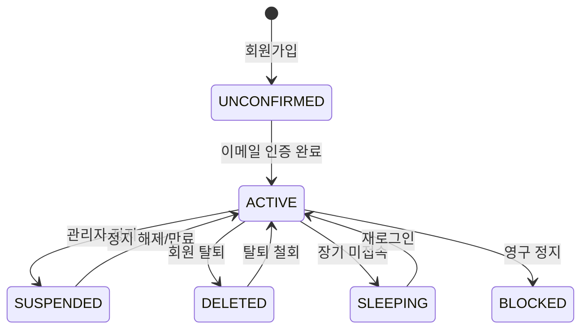

### 6.2 역할별 권한

| 규칙                  | USER | ADMIN   | GUEST | PLACE_OWNER |
|---------------------|------|---------|-------|-------------|
| 일반 로그인              | O    | O       | O     | O           |
| PLACE_MANAGER 앱 로그인 | X    | X       | X     | O           |
| 사용자 정지              | X    | O       | X     | X           |
| 역할 변경               | X    | O (내부망) | X     | X           |
| 서비스 이용              | O    | O       | 제한적   | O           |

### 6.3 Provider별 규칙

| 규칙      | SYSTEM | KAKAO  | APPLE  | GOOGLE |
|---------|--------|--------|--------|--------|
| 비밀번호 설정 | 필수     | 없음     | 없음     | 없음     |
| 이메일 인증  | 필수     | 자동 인증  | 자동 인증  | 자동 인증  |
| 비밀번호 변경 | 가능     | 불가     | 불가     | 불가     |
| 계정 연동   | -      | 이메일 기준 | 이메일 기준 | 이메일 기준 |

### 6.4 동의서 규칙

| 규칙    | 설명                                              |
|-------|-------------------------------------------------|
| 필수 동의 | 회원가입 시 TERMS_OF_SERVICE, PRIVACY_THIRD_PARTY 필수 |
| 선택 동의 | MARKETING_CONSENT, LOCATION_BASED_SERVICE       |
| 동의 철회 | 선택 동의만 철회 가능, 필수 동의 철회 시 탈퇴 필요                  |
| 버전 관리 | 약관 버전 변경 시 재동의 필요                               |

### 6.5 탈퇴 정책

| 규칙          | 설명                               |
|-------------|----------------------------------|
| Soft Delete | 탈퇴 시 status만 DELETED로 변경, 데이터 보존 |
| 보관 기간       | 3년간 데이터 보관 후 자동 삭제               |
| 탈퇴 철회       | 보관 기간 내 비밀번호 확인 후 복구 가능          |
| 재가입         | 동일 이메일로 재가입 불가 (보관 기간 내)         |

---

## 7. Redis 캐싱

### 7.1 캐시 아키텍처

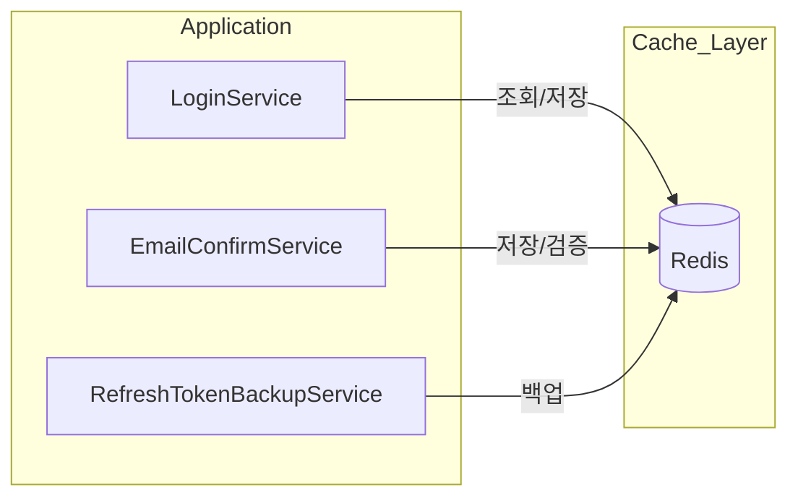

### 7.2 캐시 키 설계

| 용도            | Key Pattern                   | Value Type     | TTL       |
|---------------|-------------------------------|----------------|-----------|
| 이메일 인증 코드     | `email:{6자리코드}`               | String (email) | 5분 (300초) |
| Refresh Token | `refresh:{userId}:{deviceId}` | String (token) | 7일        |
| 로그인 세션        | `session:{userId}`            | Hash           | 1시간       |

### 7.3 Redis 활용

#### 이메일 인증 코드

```java
// 코드 생성 및 저장
String code = generateSixDigitCode();
redisTemplate.

opsForValue().

set(
    "email:"+code,
    email,
    Duration.ofMinutes(5)
);

// 코드 검증
String storedEmail = redisTemplate.opsForValue().get("email:" + code);
if(email.

equals(storedEmail)){
		redisTemplate.

delete("email:"+code);
    return true;
		    }
```

### 7.4 Graceful Degradation

| 작업       | 실패 시 동작            | 서비스 영향    |
|----------|--------------------|-----------|
| 인증 코드 저장 | 로그 기록 후 에러 반환      | 이메일 인증 불가 |
| 토큰 저장    | 로그 기록, DB fallback | 토큰 갱신 지연  |
| 세션 조회    | DB 직접 조회           | 응답 지연     |

---

## 8. 보안

### 8.1 암호화 체계

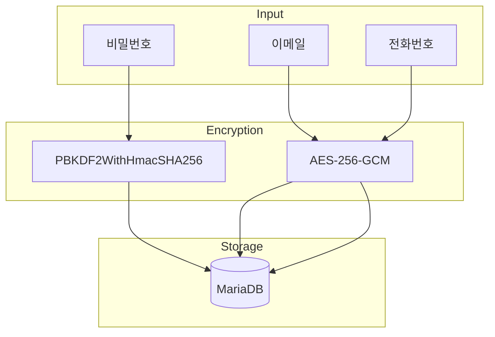

### 8.2 비밀번호 암호화

| 항목    | 값                    |
|-------|----------------------|
| 알고리즘  | PBKDF2WithHmacSHA256 |
| 반복 횟수 | 65536 (jbcrypt)      |
| Salt  | 16 bytes random      |
| 출력 길이 | 256 bits             |

### 8.3 개인정보 암호화

| 항목    | 값                         |
|-------|---------------------------|
| 알고리즘  | AES-256                   |
| 모드    | GCM (Galois/Counter Mode) |
| 대상 필드 | email, phoneNumber        |
| 키 관리  | 환경변수 (AES_KEY)            |

### 8.4 JWT 토큰 구조

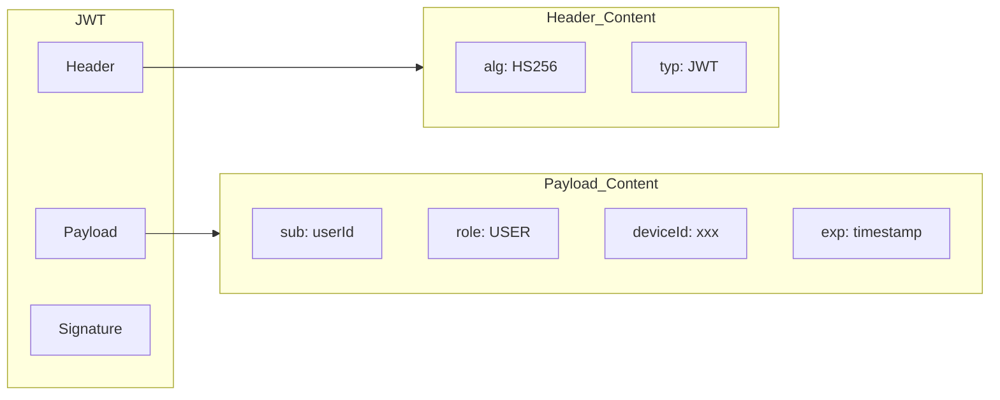

**토큰 설정:**

| 토큰 타입         | 만료 시간 | 용도              |
|---------------|-------|-----------------|
| Access Token  | 1시간   | API 인증          |
| Refresh Token | 7일    | Access Token 갱신 |

### 8.5 입력값 검증

| 필드          | 정규식                                                | 설명            |
|-------------|----------------------------------------------------|---------------|
| email       | `^[A-Za-z0-9._%+-]+@[A-Za-z0-9.-]+\.[A-Za-z]{2,}$` | RFC 5322 형식   |
| password    | `^(?=.*[A-Za-z])(?=.*\d).{8,}$`                    | 8자 이상, 영문+숫자  |
| phoneNumber | 한국 전화번호 형식                                         | 010-XXXX-XXXX |

---

## 9. 인덱스 설계

### 9.1 MariaDB 인덱스

#### Auth 테이블

```sql
-- 이메일 로그인 조회
CREATE INDEX idx_auth_email ON auth (email(191));

-- 상태별 사용자 필터링
CREATE INDEX idx_auth_status ON auth (status);

-- 가입일 기준 정렬
CREATE INDEX idx_auth_created_at ON auth (created_at);

-- 소셜 로그인 Provider 조회
CREATE INDEX idx_auth_provider ON auth (provider);
```

#### Consent 테이블

```sql
-- 사용자별 동의 이력
CREATE INDEX idx_consent_user_id ON consent (user_id);

-- 복합 인덱스 (사용자 + 동의 유형)
CREATE INDEX idx_consent_user_consent ON consent (user_id, consent_id);
```

#### Suspend 테이블

```sql
-- 사용자별 정지 이력
CREATE INDEX idx_suspend_user_id ON suspend (user_id);

-- 정지 만료 스케줄러 조회
CREATE INDEX idx_suspend_until ON suspend (suspend_until);
```

#### History 테이블

```sql
-- 사용자별 이력 조회
CREATE INDEX idx_history_user_id ON history (user_id);
```

---

## 10. 에러 코드

### 10.1 인증 에러

| 코드                  | HTTP Status | 설명           |
|---------------------|-------------|--------------|
| USER_NOT_FOUND      | 404         | 사용자를 찾을 수 없음 |
| EMAIL_NOT_FOUND     | 404         | 이메일을 찾을 수 없음 |
| PASSWORD_MISMATCH   | 400         | 비밀번호 불일치     |
| INVALID_CREDENTIALS | 401         | 잘못된 인증 정보    |
| INVALID_TOKEN       | 400         | 유효하지 않은 토큰   |
| EXPIRED_TOKEN       | 401         | 만료된 토큰       |
| INVALID_DEVICE_ID   | 400         | 디바이스 ID 불일치  |

### 10.2 이메일 에러

| 코드                    | HTTP Status | 설명           |
|-----------------------|-------------|--------------|
| EMAIL_ALREADY_EXISTS  | 409         | 이미 존재하는 이메일  |
| EMAIL_REGEX_NOT_MATCH | 400         | 이메일 형식 오류    |
| NOT_CONFIRMED_EMAIL   | 400         | 미인증 이메일      |
| INVALID_CODE          | 400         | 잘못된 인증 코드    |
| CAN_NOT_RESEND_EMAIL  | 429         | 재발송 대기 시간 필요 |

### 10.3 비밀번호 에러

| 코드                       | HTTP Status | 설명          |
|--------------------------|-------------|-------------|
| PASSWORD_REGEX_NOT_MATCH | 400         | 비밀번호 형식 오류  |
| PASSWORD_NOT_MATCH       | 400         | 비밀번호 확인 불일치 |
| INVALID_PASSWORD         | 400         | 잘못된 비밀번호    |

### 10.4 동의 에러

| 코드                             | HTTP Status | 설명           |
|--------------------------------|-------------|--------------|
| REQUIRED_CONSENT_NOT_PROVIDED  | 400         | 필수 동의 누락     |
| CONSENT_NOT_FOUND              | 404         | 동의 항목 없음     |
| NOT_CONSENTED_REQUIRED_CONSENT | 400         | 필수 동의 미완료    |
| MARKETING_CONSENT_NOT_PROVIDED | 400         | 마케팅 동의 정보 누락 |

### 10.5 사용자 상태 에러

| 코드                   | HTTP Status | 설명     |
|----------------------|-------------|--------|
| USER_IS_SLEEPING     | 400         | 휴면 계정  |
| USER_IS_BLOCKED      | 403         | 차단된 계정 |
| USER_IS_DELETED      | 400         | 탈퇴한 계정 |
| USER_IS_SUSPENDED    | 403         | 정지된 계정 |
| USER_ALREADY_BLOCKED | 409         | 이미 차단됨 |

### 10.6 권한 에러

| 코드                      | HTTP Status | 설명         |
|-------------------------|-------------|------------|
| NOT_ADMIN               | 403         | 관리자 권한 필요  |
| UNAUTHORIZED_APP_ACCESS | 403         | 앱 접근 권한 없음 |

### 10.7 기타 에러

| 코드                  | HTTP Status | 설명        |
|---------------------|-------------|-----------|
| WITHDRAW_NOT_FOUND  | 404         | 탈퇴 정보 없음  |
| SOCIAL_LOGIN_FAILED | 500         | 소셜 로그인 실패 |
| ENCRYPTION_ERROR    | 500         | 암호화 오류    |
| DECRYPTION_ERROR    | 500         | 복호화 오류    |

---

## 11. 환경 설정

### 11.1 환경 변수

```bash
# Database
DATABASE_HOST=localhost
DATABASE_PORT=3306
DATABASE_NAME=auth_db
DATABASE_USER_NAME=auths
DATABASE_PASSWORD=your_password

# Redis
REDIS_HOST=localhost
REDIS_PORT=6379

# Kafka
KAFKA_URL1=localhost:9092
KAFKA_URL2=localhost:9093
KAFKA_URL3=localhost:9094

# JWT
JWT_SECRET=your-256-bit-jwt-secret-key
JWT_ACCESS_TOKEN_EXPIRE_TIME=3600000    # 1시간 (ms)
JWT_REFRESH_TOKEN_EXPIRE_TIME=604800000 # 7일 (ms)

# AES Encryption
AES_KEY=your-32-byte-aes-encryption-key

# Spring Profile
SPRING_PROFILES_ACTIVE=dev
```

### 11.2 Docker 배포

#### Dockerfile

```dockerfile
FROM eclipse-temurin:21-jre-jammy

RUN apt-get update && \
    apt-get install -y ca-certificates && \
    rm -rf /var/lib/apt/lists/*

WORKDIR /app

COPY build/libs/*.jar /app/app.jar

EXPOSE 8080

ENTRYPOINT ["java", "-jar", "/app/app.jar"]
```

#### 멀티 아키텍처 빌드

```bash
# buildx 사용
docker buildx build \
  --platform linux/amd64,linux/arm64 \
  -t ddingsh9/auth-server:latest \
  --push .
```

### 11.3 Docker Compose

```yaml
version: '3.8'

services:
  auth-server-1:
    image: ddingsh9/auth-server:latest
    ports:
      - "8080:8080"
    environment:
      - SPRING_PROFILES_ACTIVE=prod
      - DATABASE_HOST=mariadb
      - DATABASE_PORT=3306
      - DATABASE_NAME=auth_db
      - DATABASE_USER_NAME=${DB_USER}
      - DATABASE_PASSWORD=${DB_PASSWORD}
      - REDIS_HOST=redis
      - REDIS_PORT=6379
      - KAFKA_URL1=kafka:9092
      - JWT_SECRET=${JWT_SECRET}
      - AES_KEY=${AES_KEY}
    depends_on:
      - mariadb
      - redis
      - kafka

  auth-server-2:
    image: ddingsh9/auth-server:latest
    ports:
      - "8081:8080"
    # ... 동일 설정

  auth-server-3:
    image: ddingsh9/auth-server:latest
    ports:
      - "8082:8080"
    # ... 동일 설정

  nginx:
    image: nginx:alpine
    ports:
      - "9010:80"
    volumes:
      - ./nginx.conf:/etc/nginx/nginx.conf:ro
    depends_on:
      - auth-server-1
      - auth-server-2
      - auth-server-3

  mariadb:
    image: mariadb:11.3
    environment:
      MYSQL_ROOT_PASSWORD: ${DB_ROOT_PASSWORD}
      MYSQL_DATABASE: auth_db
      MYSQL_USER: ${DB_USER}
      MYSQL_PASSWORD: ${DB_PASSWORD}
    volumes:
      - mariadb_data:/var/lib/mysql

  redis:
    image: redis:7-alpine
    ports:
      - "6379:6379"

volumes:
  mariadb_data:
```

### 11.4 Nginx 설정

```nginx
upstream auth_servers {
    server auth-server-1:8080;
    server auth-server-2:8080;
    server auth-server-3:8080;
}

server {
    listen 80;
    server_name localhost;

    location / {
        proxy_pass http://auth_servers;
        proxy_set_header Host $host;
        proxy_set_header X-Real-IP $remote_addr;
        proxy_set_header X-Forwarded-For $proxy_add_x_forwarded_for;
        proxy_set_header X-Forwarded-Proto $scheme;
    }

    location /health {
        proxy_pass http://auth_servers/health;
        access_log off;
    }
}
```

---

## 12. 스케줄링

### 12.1 스케줄 작업

| 작업               | 크론 표현식          | 설명              |
|------------------|-----------------|-----------------|
| 탈퇴 사용자 정리        | `0 0 3 * * ?`   | 3년 경과 탈퇴 사용자 삭제 |
| 정지 자동 해제         | `0 0 0 * * ?`   | 만료된 정지 자동 해제    |
| Refresh Token 백업 | `0 0 */6 * * ?` | 6시간마다 토큰 백업     |

### 12.2 ShedLock 설정

```java

@Scheduled(cron = "0 0 3 * * ?")
@SchedulerLock(
		name = "cleanupExpiredUsers",
		lockAtMostFor = "10m",
		lockAtLeastFor = "5m"
)
public void cleanupExpiredUsers() {
	// 3년 경과 탈퇴 사용자 삭제
}
```

---

## 13. 구현 우선순위

### Phase 1 - 핵심 기능 (완료)

- [x] 이메일 회원가입
- [x] 이메일 로그인
- [x] JWT 토큰 발급/갱신
- [x] 동의서 관리
- [x] 이메일 인증
- [x] Kafka 이벤트 발행

### Phase 2 - 소셜 로그인 (완료)

- [x] 카카오 로그인
- [x] 애플 로그인
- [x] 구글 로그인
- [x] X-App-Type 기반 로그인 분기

### Phase 3 - 사용자 관리 (완료)

- [x] 회원 정지/해제
- [x] 회원 탈퇴/철회
- [x] 비밀번호 변경
- [x] 역할 변경 (내부망)

### Phase 4 - 고도화 (진행 중)

- [ ] Outbox 패턴 구현
- [ ] API Gateway 연동
- [ ] Prometheus + Grafana 모니터링
- [ ] CI/CD 파이프라인

---

## 14. 참고 사항

### 14.1 Snowflake ID 생성

Auth Server는 분산 환경에서 고유 ID를 생성하기 위해 Snowflake 알고리즘을 사용한다.

```
|-- 1 bit --|-- 41 bits --|-- 10 bits --|-- 12 bits --|
|   sign    |  timestamp  |  machine id | sequence    |
```

- **64-bit 고유 ID**: 충돌 없는 분산 ID 생성
- **시간순 정렬**: timestamp 기반으로 자연 정렬 가능
- **초당 4096개**: 동일 밀리초 내 최대 시퀀스

### 14.2 X-App-Type 기반 접근 제어

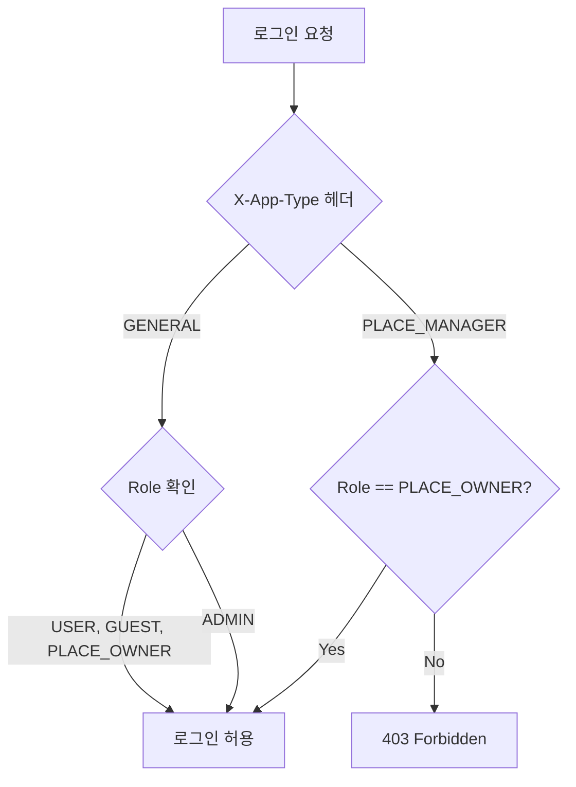

### 14.3 이메일 암호화 마이그레이션

기존 평문 이메일을 AES-256으로 암호화하여 저장한다. 로그인 시 암호화된 이메일로 먼저 조회하고, 실패 시 레거시(평문) 이메일로 조회한다.

```java
// 암호화 이메일로 조회
Optional<Auth> auth = authRepository.findByEmail(encrypt(email));

// 실패 시 레거시 조회
if(auth.

isEmpty()){
auth =authRepository.

findByEmail(email);
}
```

### 14.4 동시성 제어

- **Optimistic Locking**: `@Version` 필드로 충돌 감지
- **ShedLock**: 분산 스케줄러 중복 실행 방지
- **Redis**: 인증 코드 저장 시 원자적 연산

---

## 15. API 문서

### Swagger UI

- **개발**: `http://localhost:8080/swagger-ui.html`
- **운영**: `http://auth-server:9010/swagger-ui.html`

### OpenAPI JSON

- `http://localhost:8080/v3/api-docs`

---

**버전**: 0.0.3_proto
**최종 업데이트**: 2025-01-20
**팀**: TeamBiund Development Team
