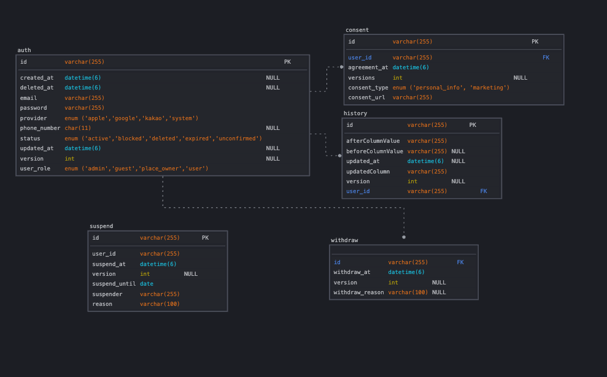

## 실무같은 와방 쩌는 로그인 시스템 구현 

---

### 요구사항 list
- [x] 유저는 이메일을 통한 회원 가입을 한다. 
- [ ] 유저는 이메일 인증을 하지 않으면, 게스트 상태이고, 외부 이메일 인증 모듈에서 이벤트로 인증 확인이 되면, user로 상태가 바뀐다.
- [ ] 유저는 이메일, 비밀번호를 통해 로그인을 한다. 
- [x] 유저는 비밀번호와 이메일을 바꿀수 있는데, 이메일 변경 요청을 하면, 이메일인증을 완료하기 전까지 기존 이메일을 따른다.
- [ ] 유저의 비밀번호와 이메일 정보는  암호화 해서 저장해야한다.
- [x] 같은 메일, 같은 비밀번호라도, 다른 암호값이 나와야하며, 복호화가 가능해야한다. 
- [x] ADMIN 유저는 일반 유저를 정지를 줄수 있다.
- [x] 회원 탈퇴 요청을 하면, 3년간 정보가 저장된 뒤에 삭제가 된다. 
- [ ] 소셜로그인(카카오, 애플)로 가입이 가능해야한다.
- [x] 이용약관과 같은 정보이용 동의를 문서 번호와 함께 동의 시각까지 기록해야한다.
- [ ] Nginx, MariaDB , Docker, kafka, Redis 를 활용한 인프라를 구성한다.
- [ ] auth 서버는 3대가 동시 가동 되어야 하며, nginx를 활용한 로드벨런싱이 되어야한다.
- [ ] 고정 스케쥴링 작업시에 동시에 여러 서버가 작업하지 않아야 한다. 
- [ ] outbox 패턴을 활용하여 이벤트 메세징 수/발신을 보장한다. 
---

###  구현 목표 
- 실제 실무 인것처럼 DDL Auto Created  사용하지 않는다. 
- Test 커버리지 80% 이상을 목표로 하며, 최대한 많은 테스트 커버리지를 확보한다. 
- Swagger를 통한 문서화 + 이벤트 명세를 통해 api 명세를 확실하게 작성한다.
- Nginx, MariaDB , Docker 를 활용한 인프라를 구성한다.

---

### ERD

---

### Test 결과 
- 2025/09/10 (version : 1.0)
[authTest_2025_09_10](authTest_2025_09_10.html)

---
