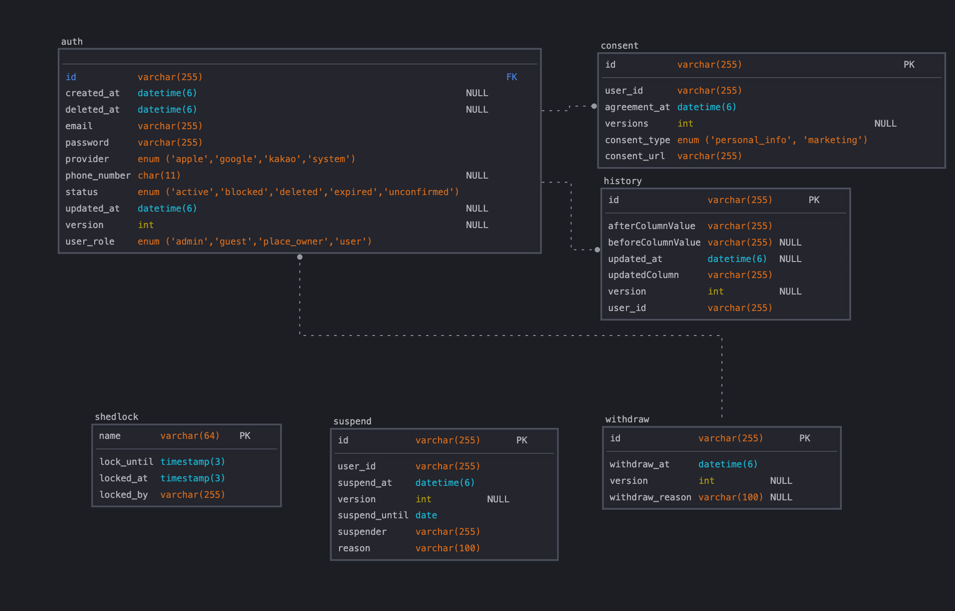
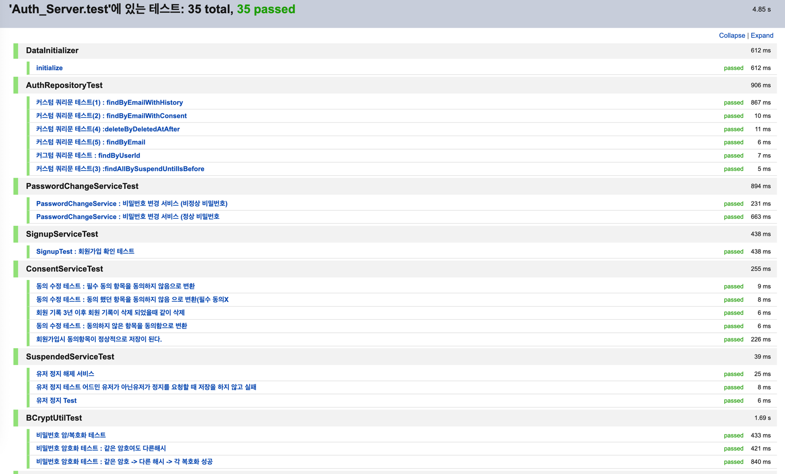
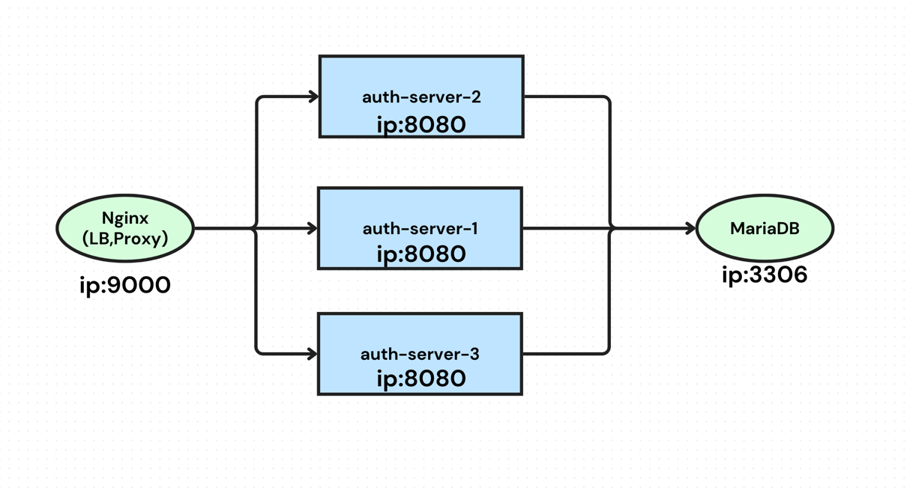
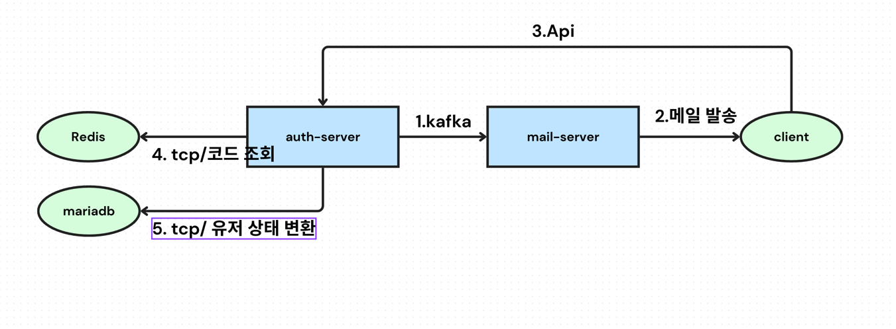

## 실무같은 와방 쩌는 로그인 시스템 구현 

---

### 요구사항 list
- [x] 유저는 이메일을 통한 회원 가입을 한다. 
- [x] 유저는 이메일 인증을 하지 않으면, 게스트 상태이고, 외부 이메일 인증 모듈에서 이벤트로 인증 확인이 되면, user로 상태가 바뀐다.
- [x] 유저는 이메일, 비밀번호를 통해 로그인을 한다. // 로그인 서버로 위임
- [x] 유저는 비밀번호와 이메일을 바꿀수 있는데, 이메일 변경 요청을 하면, 이메일인증을 완료하기 전까지 기존 이메일을 따른다.
- [ ] 유저의 비밀번호와 이메일 정보는  암호화 해서 저장해야한다.
- [x] 같은 메일, 같은 비밀번호라도, 다른 암호값이 나와야하며, 복호화가 가능해야한다. 
- [x] ADMIN 유저는 일반 유저를 정지를 줄수 있다.
- [x] 회원 탈퇴 요청을 하면, 3년간 정보가 저장된 뒤에 삭제가 된다. 
- [ ] 소셜로그인(카카오, 애플)로 가입이 가능해야한다.
- [x] 이용약관과 같은 정보이용 동의를 문서 번호와 함께 동의 시각까지 기록해야한다.
- [x] Nginx, MariaDB , Docker, kafka, Redis 를 활용한 인프라를 구성한다.
- [x] auth 서버는 3대가 동시 가동 되어야 하며, nginx를 활용한 로드벨런싱이 되어야한다.
- [x] 고정 스케쥴링 작업시에 동시에 여러 서버가 작업하지 않아야 한다.
- [ ] outbox 패턴을 활용하여 이벤트 메세징 수/발신을 보장한다. 
---

###  구현 목표 
- 실제 실무 인것처럼 DDL Auto Created  사용하지 않는다. 
- Test 커버리지 80% 이상을 목표로 하며, 최대한 많은 테스트 커버리지를 확보한다. 
- Swagger를 통한 문서화 + 이벤트 명세를 통해 api 명세를 확실하게 작성한다.
- Nginx, MariaDB , Docker 를 활용한 인프라를 구성한다.

---

### ERD

---

### Test 결과 
- 2025/09/10 (version : 1.0)
[authTest_2025_09_10](authTest_2025_09_10.html)

---

### 서버 아키택처 도식도

- 서버는 쵝소한의 부하 분산 및 성능 향상을 위해 3티어 아키택쳐로 구성했다,
	- ip:9000 으로 들어오는 요청은, Nginx가 프록시 + 로드벨런서 역할을 수행하면서 복제된 auth 3개의 서버에 골골루 작업을 넘긴다.
	- 현제 DB 는 1개를 사용하고 있지만 바인드 마운딩 을 사용하고 있기에 프록시와 디비 서버또한 복제가 가능하다.

- nginx conf
  [default.conf](nginx/conf/default.conf)

- docker compose
  [docker-compose.yml](docker-compose.yml)

---

### 이메일인증 로직도

---

### 락 구현 JDBC 기반

---

### API 호출 카운트 및 api 성능 측정 구현

- 서비스 구현 개요 :
	- 각 api의 평균적인 성능,일일 호출된 api 별 호충 통계 , 일일 방문 통계 같은
	  서비스를 제공해야 한다는 요구사항을 듣고, 서비스를 구현하기 시작했다.

- 사용 기술 :
	- Spring aop, Redis BitMap 을 이용하여 이를 구현하고자 했다.

- 기술 선택 배경
	- Spring aop
		- api 호출 카운트나, 성능 측정과 관련된 코드들은 , 비즈니스 로직의 처음 과 끝에 호출되야하는 각 메서드들이 있다(start ~ logic ~ end),
		  컨트롤러의 모든 메서드들을 이렇게 바꿀수가 없을 뿐더러, 모든 메서드읭 try ~ catch ~ finally 구문을 삽입하여 가독성을 해하는 결과를 초래하기에 이를 해결하고자 aop 를 활용하여
		  로직을 구현하고자 했다.

	- Redis Bitmap
		- 레디스에는 여러 자료형을 바디나 키로 저장 할 수 있다. 처음엔 api 를 호출할때마다 api이름을 키로 같고 네트워크 IO를 고려하여 incr 를 활용해 즉각적인 업데이트를 고려 하였지만,
		  이는 User별 방문 통계를 내기엔 상당한 어려움이 있고, user를 키로 넣고 Sets로 저장했을때는 일일 통계를 낼때 상당한 작업 리소스가 들어갈 것으로 생각되어, BitMap를 활용하여,
		  key -> api이름-날짜, offset -> 유저아이디, 를 활용하여
		  저장하기로 구현했고, 유저 아이디가 없는 경우는 난수를 지정하여 카운트 하기로 했다.

- 서비스 구현 결과     
  
  
  
레디스 모니터링을 통해 원하는 명령어가 잘 들어 갔고, 헬스체크 같이 데이터로의 의미가 없는 api는 aspect문법을 통해 뺐다.

- 구현 해야하는 남은 요소
	- 하루 레디스에 저장된 데이터를 데이터베이스에 업로드하고, 레디스 메모리르 삭제해야 하는 로직이 추가되야한다.
	- 게스트 유저에 대한 정보는 로그인 한 유저에 비해 호출별로 모두 기록하기에 게스트 유저에 대한 통계 가중치를 설정해야 한다.
	- 모든 서비스에 대해 사용할 수 있게 git을 통해 배포하여 스타터 팩으로 만들어야한다.

- *추가*
	- filter 생각을 못해서... ㅠ... aop에 정신이 나가있었나보다 필터로 확인하는것도 고려 해야하고, 필터가 좀더 나아보인다...
